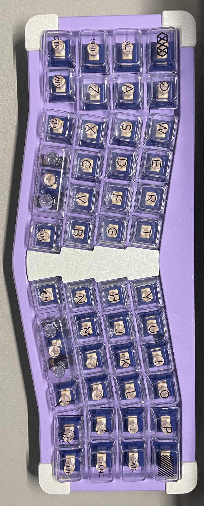

# Alik46

一个类40配列的蓝牙键盘，使用zmk固件。定位板和外壳是一体的，目前外壳支持pcb卫星轴。

# 固件地址
- [zmk固件](https://github.com/LXF-YZP/alik46)

## 元器件清单

Parts list:

| 名称                        | 数量 | 购买链接                                                                                      |
| --------------------------------- | ------ | ------------------------------------------------------------------------------------------ |
| pcb基板       |   1    | https://www.jlc.com/newOrder/#/pcb/pcbPlaceOrder                                          |
| pcb卫星轴       | 2      | https://github.com/Bastardkb/TBK-Mini-PCB-thumb-cluster                                    |
| 轴体                           | 46      |                                                                                            |
| 轴座          | 46     | https://github.com/Bastardkb/Elite-C-holder                                                |
| 锂电池                     | 1     |                                                                                            |
| 蓝牙芯片                | 1    | https://item.taobao.com/item.htm?spm=a1z09.2.0.0.70352e8dhrJ7E7&id=521330374834&_u=q1hre4ehe9b2&pisk=f6AsmeqjFndety8CmO3FdesVQJ1X5hGrMr_vrEFak1COhSLwVZPV3AbbGMT-SGkmIn9BDHXNXiWVGZtPxFPqSFujGELRXsJNbZKecH2wbIS2YjTkVOPwkIzMK388_CkGgS1Gisnr4blzIFfcMZ1QcJZg9a7tgZBAWRGB72or4bljByCjf0J2qsUFAZsdWZIAH2_dlZ1AkGetRMQfr-E9Ds3BJMb0BZIOX9QdoNFxdV2llfs652dQLpquocJhASF8rgWtkey4Z7XOWTfbngVA8B_1CgL9sxeS0Z9JNOx-YRS9FFt5zhlL13T9OHsp6mVGmL8Ws9A-V85JEF5weHhQ19v9RI6kixEV06IdhiKqk8sD8LtfUCo_ZGBWULBBibVM5TjOOwAqx5IXpKdNIsqtfOTvOI6MNDPfcL8eO99E1ujFEZIrl7SS3YebRTVfRguIR-22DV9dxlx3PmWO-N_KR2Z6mOQhRw0IR-2cBwbEJ2gQfnf..                                                                                     |
| 螺柱 | 4    | https://fr.aliexpress.com/item/4000232925592.html?spm=a2g0s.12269583.0.0.6aef4f282LZO4v    |
| 蓝牙天线                   | 1     |                                                                                            |
| 螺丝                   | 4      | https://www.aliexpress.com/item/1005001304569553.html?spm=a2g0s.9042311.0.0.27424c4dDwgcp7 |
|  二极管          | 46     | https://item.taobao.com/item.htm?spm=a1z09.2.0.0.70352e8dhrJ7E7&id=528155613240&_u=q1hre4eh412c                                                                        |
|  按键开关          | 1     | https://item.taobao.com/item.htm?spm=a1z09.2.0.0.70352e8dhrJ7E7&id=546724645617&_u=q1hre4eh5b12                                                                        |
|  卧贴连接器          | 1     | https://item.taobao.com/item.htm?spm=a1z09.2.0.0.70352e8dhrJ7E7&id=565715285795&_u=q1hre4eh267c                                                                        |
|  拨动开关          | 1     | https://item.taobao.com/item.htm?spm=a1z09.2.0.0.70352e8dhrJ7E7&id=557092773462&_u=q1hre4eh5b2e                                                                        |
|  拨动开关          | 1     | https://item.taobao.com/item.htm?spm=a1z09.2.0.0.70352e8dhrJ7E7&id=557092773462&_u=q1hre4eh5b2e                                                                        |
|  拨动开关          | 1     | https://item.taobao.com/item.htm?spm=a1z09.2.0.0.70352e8dhrJ7E7&id=557092773462&_u=q1hre4eh5b2e                                                                        |
|  拨动开关          | 1     | https://item.taobao.com/item.htm?spm=a1z09.2.0.0.70352e8dhrJ7E7&id=557092773462&_u=q1hre4eh5b2e                                                                        |
|  拨动开关          | 1     | https://item.taobao.com/item.htm?spm=a1z09.2.0.0.70352e8dhrJ7E7&id=557092773462&_u=q1hre4eh5b2e                                                                        |

## 外壳打印
- 自己使用3D打印机进行打印，由于外壳不存在太多曲面，所以支撑部分不用很复杂。本人使用拓竹A1打印，效果不错。

- 在未来工厂进行下单打印。

- 在三维猴进行下单打印。

- 在客制化群里面花钱请老哥进行代打或者咸鱼花钱请代打。

# 构建指南

_具体构建指南请参考B站视频讲解_

